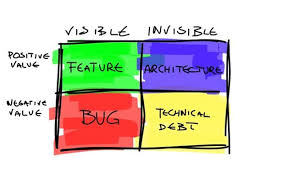

I am now putting the final touches on a book on Technical Debt (dealing with page proofs and such).  The title of the book is "Technical Debt in Practice" and it is co-authored by Julien Delange (Twitter) and Neil Ernst (University of Victoria).  We expect to publish this delightful book of wit and wisdom by the end of 2020.  It will be published by MIT Press.  
