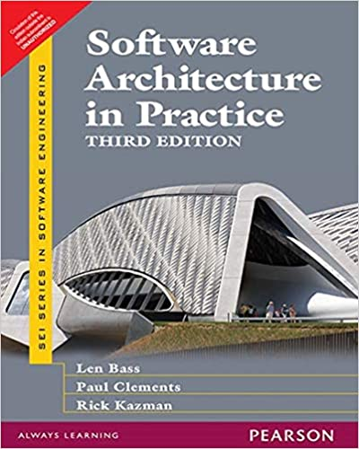

Along with Len Bass and Paul Clements I am nearly finished writing the 4th edition of *Software Architecture in Practice*.   We expect to publish this book in early 2021, just in time for the summer gift-giving season.  It will be published by Pearson, as we the 1st, 2nd, and 3rd editions.
